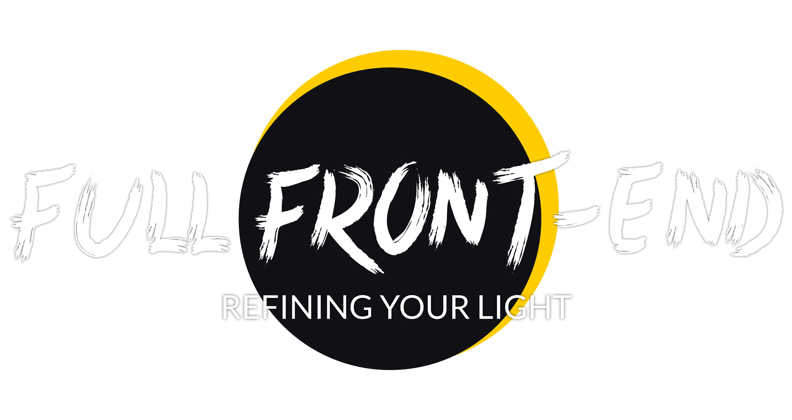

  

<h1 align="center">Full Front-End</h1>

  We build systems that stay simple.

  Not lighter. Not trendier. 
  Just clearer, more durable, and actually usable.

---

## What this is

Full Front-End is a personal organization.

Not an agency.  
Not a startup.

It’s a space to design, test and refine:

- automation systems
- self-hosted tools
- simple architectures
- real-world workflows

Everything here follows the same rule:

> If it becomes complex, it’s broken.

---

## Projects

### Core

#### [Retaia](https://github.com/Retaia)

A central project focused on structuring information and building systems that stay usable over time.

---

### Infrastructure (current)

#### [FFE-Terraform](https://github.com/fullfrontend/FFE-Terraform)

The current server architecture behind Full Front-End.

Self-hosted infrastructure using OpenTofu, Kubernetes and Helm.

---

### Infrastructure (previous / building blocks)

#### [traefik-cfg](https://github.com/fullfrontend/traefik-cfg)

Reverse proxy setup from a previous production architecture.

#### [docker-mkcert](https://github.com/fullfrontend/docker-mkcert)

Docker container for generating valid local SSL certificates.

---

### Containers & base images

- [php-fpm](https://github.com/fullfrontend/php-fpm)
- [nginx](https://github.com/fullfrontend/nginx)
- [nginx-symfony](https://github.com/fullfrontend/nginx-symfony)

Reusable building blocks for self-hosted environments.

---

### Tools

#### [obsidian-projects](https://github.com/fullfrontend/obsidian-projects)

Plain-text project management for Obsidian.

---

### Legacy / archive

These repositories reflect previous work and experiments.

- [shared-server](https://github.com/fullfrontend/shared-server)
- [owasp-password-strength-test](https://github.com/fullfrontend/owasp-password-strength-test)
- [sentry-dokku](https://github.com/fullfrontend/sentry-dokku)
- [icls](https://github.com/fullfrontend/icls)

They remain available but are no longer actively maintained.

---

### In progress

Some parts of the system are still being extracted and open-sourced:

- auto-deployment systems
- infrastructure workflows
- automation setups

---

## Philosophy

You don’t need more tools.

You need something that holds.

---

## Behind this

Full Front-End is run by one person.

### [he8us](https://github.com/he8us)

Builder, developer, and coach.

I build systems that stay simple, usable, and under control.

No layers for the sake of it.  
No tools you don’t understand.  
Just something that holds.